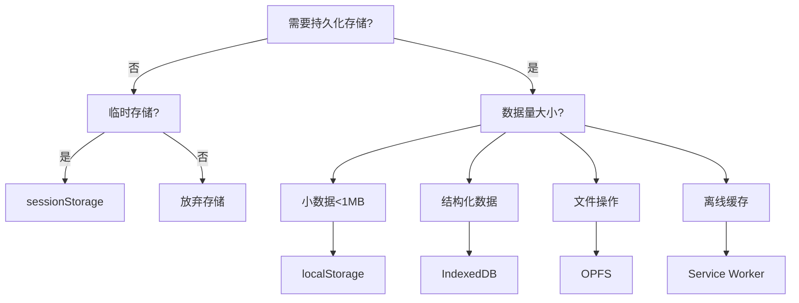

出处：[掘金](https://juejin.cn/post/7498619063670997044)

原作者：ErpanOmer

---

# 方案

## Cookie

存储容量：4KB

```js
// 原始 API 的恐怖之处
document.cookie = `user=John; path=/; expires=${new Date(2025,0,1).toUTCString()}`;
document.cookie = `theme=dark; SameSite=Lax; Secure`;

// 现代封装方案
const cookieStorage = {
  set(key, value, days=7) {
    const date = new Date();
    date.setTime(date.getTime() + (days*24*60*60*1000));
    document.cookie = `${key}=${value};expires=${date.toUTCString()};path=/`;
  },
  get(key) {
    return document.cookie.split('; ')
      .find(row => row.startsWith(`${key}=`))
      ?.split('=')[1];
  }
}
```

**灵魂拷问**：

- 为什么每个请求都携带 Cookie 导致带宽浪费？
- 如何避免 XSS 攻击窃取敏感 Cookie？（HttpOnly + Secure）
- 现代前端是否应该完全弃用 Cookie？（身份验证除外）

## Web Storage

localStorage & sessionStorage

```js
// 容量测试（5MB 理论值）
const testData = new Array(5 * 1024 * 1024).fill('a').join('');
try {
  localStorage.setItem('stressTest', testData);
} catch (e) {
  console.error('存储超出限制:', e);
}

// 类型转换陷阱
localStorage.setItem('number', 123); 
console.log(typeof localStorage.getItem('number')); // "string"

// 安全监听（同源页面间）
window.addEventListener('storage', (e) => {
  console.log(`${e.key} 被修改为 ${e.newValue}`);
});
```

**性能警示**：

- 大容量存储导致主线程阻塞
- 同步 API 对 SPA 应用的性能影响

## IndexedDB

现代浏览器数据库

```js
// 创建数据库
const request = indexedDB.open('MyDatabase', 2);

request.onupgradeneeded = (e) => {
  const db = e.target.result;
  if (!db.objectStoreNames.contains('files')) {
    const store = db.createObjectStore('files', { 
      keyPath: 'id',
      autoIncrement: true 
    });
    store.createIndex('by_type', 'type', { unique: false });
  }
};

// 事务操作
const tx = db.transaction('files', 'readwrite');
tx.objectStore('files').put({
  type: 'image',
  content: blobData,
  timestamp: Date.now()
});
```

**进阶技巧**：

- 使用 Dexie.js 等库简化操作
- Web Worker 中运行避免阻塞
- 二进制数据存储（File/Blob）

## Web SQL

虽死犹存的 SQL

```js
// 最后的挽歌
const db = openDatabase('mydb', '1.0', 'Test DB', 2 * 1024 * 1024);
db.transaction((tx) => {
  tx.executeSql('CREATE TABLE IF NOT EXISTS logs (id unique, message)');
  tx.executeSql('INSERT INTO logs (id, message) VALUES (?, ?)', [Date.now(), 'error']);
});
```

**墓碑警告**：

- 2010 年 W3C 停止维护
- 仅 Chrome 和 Safari 部分支持

## Service Worker

离线缓存策略

```js
// 注册Service Worker
navigator.serviceWorker.register('/sw.js');

// sw.js核心代码
const CACHE_NAME = 'v1';
self.addEventListener('install', (e) => {
  e.waitUntil(
    caches.open(CACHE_NAME)
      .then(cache => cache.addAll([
        '/',
        '/app.js',
        '/style.css'
      ]))
  );
});

// 网络优先回退策略
self.addEventListener('fetch', (e) => {
  e.respondWith(
    fetch(e.request)
      .catch(() => caches.match(e.request))
  );
});
```

**缓存策略矩阵**：

| 策略类型 | 适用场景   | 代码实现难度 |
| ---- | ------ | ------ |
| 缓存优先 | 静态资源   | ⭐⭐     |
| 网络优先 | 实时性要求高 | ⭐⭐⭐    |
| 仅缓存  | 离线应用   | ⭐      |
| 动态更新 | 频繁更新内容 | ⭐⭐⭐⭐   |

## File System Access API

本地文件系统交互

```js
// 获取文件句柄
const handle = await window.showOpenFilePicker({
  types: [{
    description: 'Text Files',
    accept: {'text/plain': ['.txt']}
  }]
});

// 写入操作
const writable = await handle.createWritable();
await writable.write('Hello World');
await writable.close();

// 目录操作
const dirHandle = await window.showDirectoryPicker();
for await (const entry of dirHandle.values()) {
  console.log(entry.kind, entry.name);
}
```

**权限管理**：

- 用户显式授权机制
- 沙盒限制与隐私保护

## Origin Private FileSystem (OPFS)

浏览器私有文件系统

```js
// 获取OPFS根目录
const root = await navigator.storage.getDirectory();

// 创建并写入文件
const fileHandle = await root.getFileHandle('data.bin', { create: true });
const writable = await fileHandle.createWritable();
await writable.write(new Uint8Array([1,2,3,4,5]));
await writable.close();

// 高性能随机访问
const file = await fileHandle.getFile();
const buffer = await file.arrayBuffer();
const accessHandle = await fileHandle.createSyncAccessHandle();
accessHandle.write(buffer, { at: 0 });
accessHandle.flush();
accessHandle.close();
```

**性能对比**：

|操作类型|传统 IndexedDB|OPFS|
|---|---|---|
|100 MB 写入|3200 ms|850 ms|
|随机读取|需要反序列化|直接内存访问|
|大文件处理|容易崩溃|稳定支持|

# 技术选型决策树



# 灵魂拷问

1. 为什么 OPFS 能比传统存储快 3-5 倍？
    - **答案**：绕过序列化/反序列化过程，直接操作二进制内存
2. 如何实现浏览器存储加密？  
	- **方案**：Web Crypto API + 客户端加密策略
3. 隐私模式下哪些存储可用？  
	- **真相**：所有存储仍可用，但会话结束即清除

# 相关工具

- [StorageManager API](https://developer.mozilla.org/en-US/docs/Web/API/StorageManager)：查看存储配额
- [Dexie.js](https://dexie.org/)：IndexedDB 优雅封装
- [browser-fs-access](https://github.com/GoogleChromeLabs/browser-fs-access)：文件访问 ponyfill
