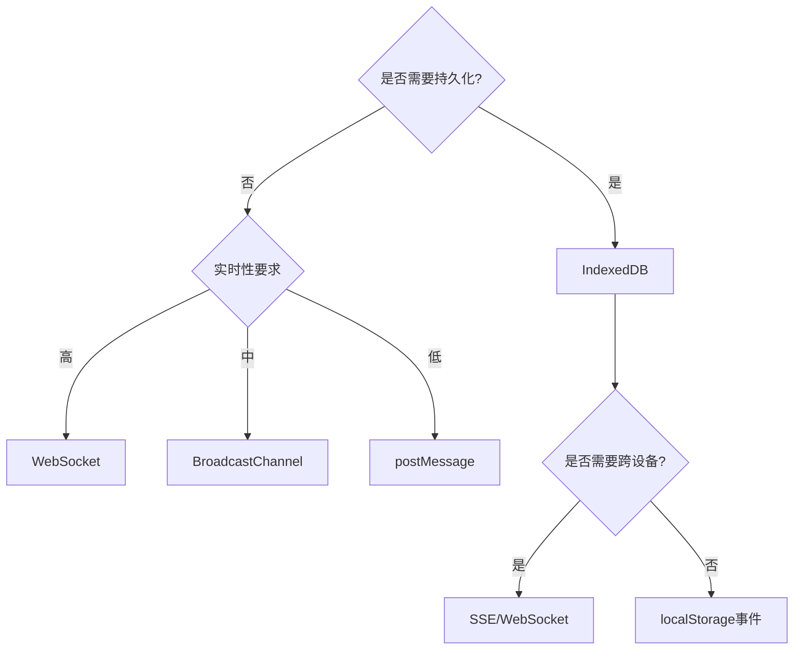

出处：[掘金](https://juejin.cn/post/7498619063671046196)

原作者：ErpanOmer

---

# 方案

## postMessage

> “安全与效率的平衡术”

`window.open`、`iframe`、`worker` ……

```js
// 父窗口发送
const child = window.open('child.html');
child.postMessage({ type: 'AUTH_TOKEN', token: 'secret' }, 'https://your-domain.com');

// 子窗口接收
window.addEventListener('message', (e) => {
  if (e.origin !== 'https://parent-domain.com') return;
  console.log('收到消息:', e.data);
});
```

**安全守则**：

1. 始终验证 `origin` 属性
2. 敏感数据使用 `JSON.stringify` + `加密`
3. 使用 `transfer` 参数传递大型二进制数据（如 `ArrayBuffer`）

## MessageChannel

> “高性能私有通道”

```js
// 建立通道
const channel = new MessageChannel();

// 端口传递
parentWindow.postMessage('INIT_PORT', '*', [channel.port2]);

// 接收端处理
channel.port1.onmessage = (e) => {
  console.log('通过专用通道收到:', e.data);
};

// 发送消息
channel.port1.postMessage({ priority: 'HIGH', payload: data });
```

**性能优势**：

- 相比普通 `postMessage` 减少 50% 的序列化开销
- 支持传输 10 MB 以上文件（Chrome 实测）

## BroadcastChannel

> “同源全域广播”

```js
// 发送方
const bc = new BroadcastChannel('app-channel');
bc.postMessage({ event: 'USER_LOGOUT' });

// 接收方
const bc2 = new BroadcastChannel('app-channel');
bc2.onmessage = (e) => {
  if (e.data.event === 'USER_LOGOUT') {
    localStorage.clear();
  }
};
```

**适用场景**：

- 多标签页状态同步
- 全局事件通知系统
- 跨 `iframe` 配置更新

## SharedWorker

> “持久化通信枢纽”

```js
// worker.js
const connections = [];
onconnect = (e) => {
  const port = e.ports[0];
  connections.push(port);
  
  port.onmessage = (e) => {
    connections.forEach(conn => {
      if (conn !== port) conn.postMessage(e.data);
    });
  };
};

// 页面使用
const worker = new SharedWorker('worker.js');
worker.port.start();
worker.port.postMessage('来自页面的消息');
```

**内存管理**：

- 每个 SharedWorker 实例共享同一个全局作用域
- 需要手动清理断开连接的端口

## localStorage

> “投机取巧的同步”

```js
// 页面A
localStorage.setItem('sync-data', JSON.stringify({
  timestamp: Date.now(),
  data: '重要更新'
}));

// 页面B
window.addEventListener('storage', (e) => {
  if (e.key === 'sync-data') {
    const data = JSON.parse(e.newValue);
    console.log('跨页更新:', data);
  }
});
```

**致命缺陷**：

- 事件仅在**其他**页面触发
- 同步 API 导致主线程阻塞
- 无法传递二进制数据

## IndexedDB

> “数据库驱动通信”

```js
// 建立观察者
let lastVersion = 0;
const db = await openDB('msg-db', 1);

db.transaction('messages')
  .objectStore('messages')
  .openCursor().onsuccess = (e) => {
    const cursor = e.target.result;
    if (cursor && cursor.value.version > lastVersion) {
      lastVersion = cursor.value.version;
      handleMessage(cursor.value);
    }
  };

// 写入新消息
await db.add('messages', {
  version: Date.now(),
  content: '新订单通知'
});
```

**适用场景**：

- 需要持久化保存的通信记录
- 离线优先的跨窗口消息队列

## `Window.name`

> “上古秘术”

```js
// 页面 A
window.name = JSON.stringify({ session: 'temp123' });
location.href = 'pageB.html';

// 页面 B
const data = JSON.parse(window.name);
console.log('穿越传递:', data);
```

**安全警告**：

- 数据暴露在所有同源页面
- 最大容量约 2 MB
- 现代应用已不建议使用

## Server-Sent Events (SSE)

> “服务器中转”

```js
// 服务端（Node.js）
app.get('/updates', (req, res) => {
  res.setHeader('Content-Type', 'text/event-stream');
  setInterval(() => {
    res.write(`data: ${Date.now()}\n\n`);
  }, 1000);
});

// 浏览器端
const es = new EventSource('/updates');
es.onmessage = (e) => {
  allWindows.forEach(w => w.postMessage(e.data));
};
```

**架构优势**：

- 支持跨设备同步
- 自动重连机制
- 与 WebSocket 互补（单向 VS. 双向）

---

## WebSocket

> "实时通信终极形态"

```js
// 共享连接管理
const wsMap = new Map();

function connectWS() {
  const ws = new WebSocket('wss://push.your-app.com');
  
  ws.onmessage = (e) => {
    const data = JSON.parse(e.data);
    if (data.type === 'BROADCAST') {
      broadcastToAllTabs(data.payload);
    }
  };
  
  return ws;
}

// 页面可见性控制
document.addEventListener('visibilitychange', () => {
  if (document.hidden) {
    ws.close(); 
  } else {
    ws = connectWS();
  }
});
```

**性能优化**：

- 心跳包维持连接（每 30 秒）
- 消息压缩（JSON → ArrayBuffer）
- 退避重连策略

# 技术选型决策树



# 灵魂拷问

1. **如何防止跨窗口消息风暴？**
    - 采用消息节流（throttle）
    - 使用 `window.performance.now()` 标记时序
    - 实施优先级队列
2. **哪种方式最适合微前端架构？**
    - `BroadcastChannel` 全局通信 + `postMessage` 父子隔离
3. **如何实现跨源安全通信？**
    - 使用 `iframe` 作为代理中继
    - 配合 CORS 和 `document.domain` 设置

# 调试工具推荐

- [Charles](https://www.charlesproxy.com/)：抓取 WebSocket 消息
- [Postman](https://www.postman.com/)：模拟 SSE 事件流

**性能检测代码**：

```js
// 通信延迟检测
const start = performance.now();
channel.postMessage('ping');
channel.onmessage = () => {
  console.log('往返延迟:', performance.now() - start);
};
```
