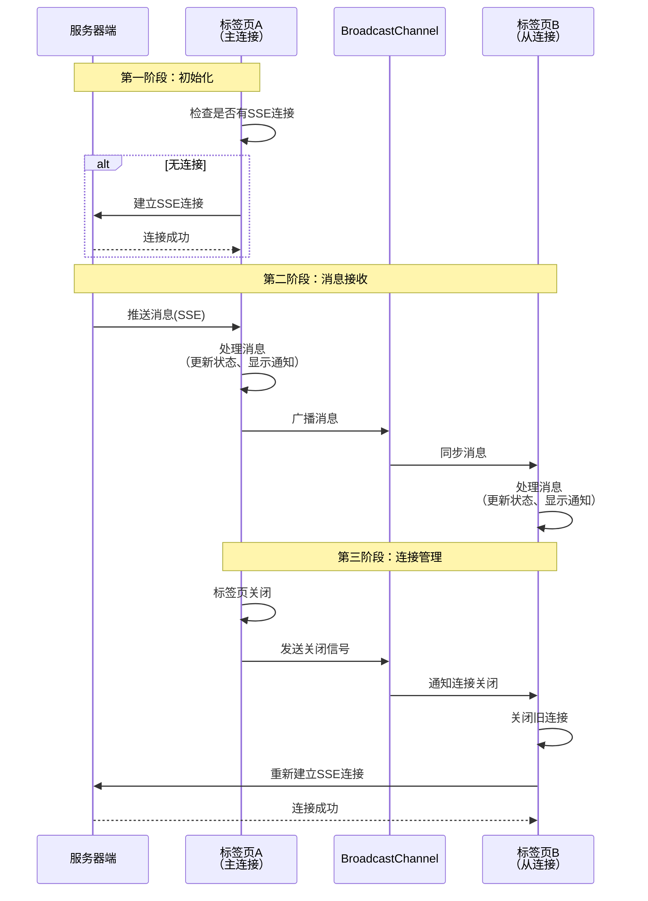

出处：[掘金](https://juejin.cn/post/7588355695100854281)

原作者：Focus_

---

# 前言

在现代 Web 应用中，实时消息推送、任务状态更新等是常见的需求。然而，当用户同时打开多个标签页时，如何确保消息能够正确同步到所有标签页，同时避免重复连接和资源浪费，是一个值得深入探讨的技术问题

本文基于实际项目经验，分享如何通过 **SSE（Server-Sent Events）+ BroadcastChannel API** 的组合方案，实现高效的多标签页实时消息同步。该方案不仅解决了单标签页消息推送的问题，还优雅地处理了多标签页场景下的连接管理和消息分发

# 适用场景

**推荐使用**：

- **实时消息推送**：系统通知、用户消息、业务提醒等
- **数据同步**：多标签页状态同步、购物车同步、表单数据同步
- **任务状态更新**：后台任务进度、数据处理状态、导出任务完成通知
- **系统公告**：全局消息广播、系统维护通知、版本更新提示

**实际案例**：

在我们的 BI 系统中，该方案成功应用于：

- 消息中心：实时推送系统消息和业务通知
- 任务管理：后台数据处理任务的状态更新和完成通知（如素材批量上传任务）
- 国际化同步：多语言配置的实时更新

> 国际化同步这块配合 apollo 的配置中心实现多语言配置更新发布后，系统会无感自动实时更新翻译，超级爽

**不推荐使用**：

- **高频双向通信**：如实时聊天、游戏等，建议使用 WebSocket
- **大量数据传输**：如文件传输、大数据同步，建议使用 HTTP 轮询或分页
- **跨域通信**：需要使用 postMessage 或其他跨域方案

# 问题背景

## 多标签页消息同步的挑战

在实际业务场景中，我们遇到了以下问题：

**场景一：用户打开多个标签页**

当用户同时打开多个标签页访问同一个应用时，如果每个标签页都建立独立的 SSE 连接，会导致：

- 服务器资源浪费（多个长连接）
- 消息重复推送（每个标签页都收到相同消息）
- 用户体验不一致（不同标签页消息状态不同步）

> 打开多页签若系统采用 HTTP 1.0/1.1 协议，用户每打开一个页面就会建立一个长连接；当打开的标签页数量超过 6 个时，受浏览器并发连接数限制，第七个及之后的标签页将无法正常加载，出现卡顿

**场景二：标签页关闭与重连**

当某个标签页关闭时，如果该标签页持有唯一的 SSE 连接，其他标签页将无法继续接收消息。需要：

- 检测连接断开
- 自动在其他标签页重新建立连接
- 保证消息不丢失

**场景三：消息去重与状态同步**

多个标签页需要：

- 避免重复显示相同的消息通知
- 保持消息已读/未读状态同步
- 统一更新 UI 状态（如未读消息数）

## 传统方案的局限性

| 方案              | 优点           | 缺点                     |
| --------------- | ------------ | ---------------------- |
| 纯 SSE           | 实现简单，浏览器原生支持 | 多标签页会建立多个连接，资源浪费       |
| 纯 WebSocket     | 双向通信，功能强大    | 实现复杂，需要心跳检测，多标签页问题同样存在 |
| LocalStorage 事件 | 跨标签页通信简单     | 只能传递字符串，性能较差，不适合频繁通信   |
| SharedWorker    | 真正的单例连接      | 兼容性一般，调试困难             |

# 技术选型

## 为什么选择 SSE

**SSE（Server-Sent Events）** 是 HTML5 标准中的一种服务器推送技术，具有以下优势：

1. **简单易用**：基于 HTTP 协议，无需额外协议升级
2. **自动重连**：浏览器原生支持断线重连机制
3. **单向推送**：适合服务器主动推送消息的场景
4. **文本友好**：天然支持文本数据，JSON 解析方便

```js
// SSE 基本使用
const eventSource = new EventSource('/api/sse');
eventSource.onmessage = (event) => {
  console.log('收到消息:', event.data);
};
```

[[019.Server-Sent Events|Server-Sent Events]]

## 为什么选择 BroadcastChannel

**BroadcastChannel API** 是 HTML5 提供的跨标签页通信方案：

1. **同源通信**：同一域名下的所有标签页可以通信
2. **简单高效**：API 简洁，性能优秀
3. **类型支持**：支持传输对象、数组等复杂数据类型
4. **事件驱动**：基于事件机制，易于集成

```js
// BroadcastChannel 基本使用
const channel = new BroadcastChannel('my-channel');
channel.postMessage({ type: 'MESSAGE', data: 'Hello' });
channel.onmessage = (event) => {
  console.log('收到广播:', event.data);
};
```

## 组合方案的优势

将 SSE 和 BroadcastChannel 结合，可以实现：

- **单连接管理**：只有一个标签页建立 SSE 连接
- **消息广播**：SSE 接收的消息通过 BroadcastChannel 同步到所有标签页
- **连接恢复**：标签页关闭时，其他标签页自动接管连接
- **状态同步**：所有标签页的消息状态保持一致

# 实现方案

## 整体架构设计



## 核心流程

1. **初始化阶段**
    - 应用启动时，检查是否已有 SSE 连接
    - 如果没有，当前标签页建立 SSE 连接
    - 如果有，直接使用现有连接
2. **消息接收阶段**
    - SSE 连接接收到服务器推送的消息
    - 当前标签页处理消息（显示通知、更新状态）
    - 通过 BroadcastChannel 广播消息到其他标签页
    - 其他标签页接收广播，同步处理消息
3. **连接管理阶段**
    - 标签页关闭时，发送关闭信号到 BroadcastChannel
    - 其他标签页监听到关闭信号，关闭旧连接
    - 重新建立 SSE 连接，确保消息不中断

> 注意这里服务端接入 SSE 的时候可以设置同一用户下只保持一个活跃连接即可，历史连接丢弃超时会自动断开

# 核心实现

## 1. SSE 连接封装

首先，需要封装一个支持重连和错误处理的 SSE 连接工具：

```ts
import { EventSourcePolyfill } from 'event-source-polyfill';
import util from '@/libs/util';
import Setting from "@/setting";

const MAX_RETRY_COUNT = 3;
const RETRY_DELAY = 3000;

const create = (url, payload) => {
  let retryCount = 0;

  const connect = () => {
    const token = util.cookies.get("token")
    if(!token){
      return
    }

    const eventSource = new EventSourcePolyfill(
      `${Setting.request.apiBaseURL}${url}`,
      {
        headers: {
          token: util.cookies.get("token"),
          pageUrl: window.location.pathname,
          userId: util.cookies.get("userId"),
        },
        heartbeatTimeout: 28800000, // 8小时心跳超时
      }
    );

    eventSource.addEventListener("open", function (e) {
      console.log('SSE连接成功');
      retryCount = 0; // 重置重试次数
    });

    eventSource.addEventListener("error", function (err) {
      console.error('SSE连接错误:', err);

      if (retryCount < MAX_RETRY_COUNT) {
        retryCount++;
        console.log(`尝试重新连接 (${retryCount}/${MAX_RETRY_COUNT})...`);
        setTimeout(() => {
          eventSource.close();
          connect();
        }, RETRY_DELAY);
      } else {
        console.error('SSE连接失败，已达到最大重试次数');
        eventSource.close();
      }
    });

    return eventSource;
  };

  return connect();
}

export default {
  create
}
```

**关键点解析**：

- 使用 `EventSourcePolyfill` 支持自定义 headers（原生 EventSource 不支持）
- 实现自动重连机制，最多重试 3 次
- 设置心跳超时时间，防止长时间无响应导致连接假死
- 在 headers 中传递 token 和页面信息，便于服务端识别和路由

## 2. BroadcastChannel 封装

创建一个简洁的 BroadcastChannel 工具类：

```ts
export const createBroadcastChannel = (channelName: string) => {
  const channel = new BroadcastChannel(channelName);
  return {
    channel,
    sendMessage(data: any) {
      channel.postMessage(data);
    },
    receiveMessage(callback: (data: any) => void) {
      channel.onmessage = (event) => {
        callback(event.data);
      };
    },
    closeChannel() {
      channel.close();
    },
  };
};
```

**设计说明**：

- 封装成工厂函数，便于创建多个通道（消息通道、连接管理通道）
- 提供简洁的 API：发送消息、接收消息、关闭通道
- 支持传递任意类型数据（对象、数组等）

## 3. SSE 连接管理

实现单例模式的 SSE 连接管理：

```ts
import sseRequest from "@/plugins/request/sse";
import store from "@/store";

export const fetchSSE = (payload?: { [key: string]: string }) => {
  const eventSource = sseRequest.create("/sse/connect", {
    ...payload
  });
  return eventSource;
};

export const initSSEEvent = async () => {
  console.log('sse-init');
  // 检查是否已经有实例在当前标签页中创建，可用于项目中获取实例方法用
  let eventSource = (store.state as any).admin.request.sseEvent;

  if (!eventSource) {
    // 如果没有实例，则创建一个新的
    eventSource = fetchSSE();
    // 存储到 Vuex 中
    store.commit('admin/request/SET_SSE_EVENT', eventSource);
  }

  return eventSource;
};
```

**核心逻辑**：

- 通过 Vuex 全局状态管理 SSE 连接实例
- 实现单例模式：如果已有连接，直接复用
- 避免多个标签页同时建立连接

## 4. 消息处理与广播

实现消息接收、处理和跨标签页同步：

```ts
import { createBroadcastChannel } from "@/libs/broadcastChannel";

// 创建消息广播通道
const { sendMessage, receiveMessage } =
  createBroadcastChannel("message-channel");

export const pushWatchAndShowNotifications = async (): Promise<any> => {
  // 获取 SSE 连接实例
  const eventSource = (store.state as any).admin.request.sseEvent;
  if (!eventSource) {
    return;
  }

  // 监听服务器推送的消息
  eventSource.addEventListener("MESSAGE", function (e) {
    const fmtData = JSON.parse(e.data);

    // 1. 广播消息到其他标签页
    sendMessage(fmtData);

    // 2. 当前标签页处理消息
    handleIncomingMessage(fmtData);
  });

  // 监听用户任务推送
  eventSource.addEventListener("USER_TASK", function (e) {
    const fmtData = JSON.parse(e.data);

    // 广播任务消息到其他标签页
    sendMessage({ type: "USER_TASK", data: fmtData });

    // 当前标签页处理任务消息
    handleIncomingUserTask(fmtData);
  });

  // 监听其他标签页广播的消息
  receiveMessage((data) => {
    if (data.type === "USER_TASK") {
      handleIncomingUserTask(data.data);
    } else {
      handleIncomingMessage(data);
    }
  });

  return eventSource;
};

function handleIncomingMessage(fmtData: any) {
  const productId = (store.state as any).admin.user.info?.curProduct;
  const productData = fmtData[productId];
  if (!productData) {
    return;
  }

  const { noReadCount, popupList } = productData;
  // 更新未读消息数
  store.commit("admin/layout/setUnreadMessage", noReadCount);

  // 显示消息通知
  if (popupList.length > 0) {
    popupList.forEach((message, index) => {
      showNotification(message, index);
    });
  }
}
```

**处理流程**：

1. SSE 接收到消息后，立即通过 BroadcastChannel 广播
2. 当前标签页处理消息（更新状态、显示通知）
3. 其他标签页通过 BroadcastChannel 接收消息，同步处理
4. 确保所有标签页状态一致

## 5. 连接恢复机制

实现标签页关闭时的连接恢复：

```ts
import { createBroadcastChannel } from '@/libs/broadcastChannel';

// 创建连接管理通道
const { sendMessage, receiveMessage } =
  createBroadcastChannel('sse-close-channel');

export default defineComponent({
  methods: {
    handleCloseMessage() {
      const sseEvent = (store.state as any).admin.request.sseEvent
      if (sseEvent) {
        sseEvent.close()
        store.commit('admin/request/CLEAR_SSE_EVENT');
      }
    },
    handleSSEClosed() {
      // 监听其他标签页关闭 SSE 连接的消息
      receiveMessage((data) => {
        if (data === 'sse-closed') {
          console.log('SSE connection closed in another tab. Re-establishing connection.');
          // 关闭旧连接
          this.handleCloseMessage()
          // 重新建立连接
          initSSEEvent();
          this.handleGetMessage()
          this.handleGetUserTasks()
        }
      });
    }
  },
  mounted() {
    // 页面卸载时，关闭 SSE 连接并通知其他标签页
    on(window, 'beforeunload', () => {
      const eventSource = (store.state as any).admin.request.sseEvent;
      if (eventSource) {
        eventSource.close();
        store.commit('admin/request/CLEAR_SSE_EVENT');
      }
      // 广播关闭消息
      sendMessage('sse-closed');
    });

    // 初始化 SSE 连接
    const token = (store.state as any).admin.user.info?.curProduct
      || util.cookies.get("token");
    if (token && !(store.state as any).admin.request.sseEvent) {
      initSSEEvent();
      pushWatchAndShowNotifications();
    }

    // 监听其他标签页的连接关闭事件
    this.handleSSEClosed();
  },
  beforeUnmount() {
    this.handleCloseMessage()
  }
})
```

**恢复机制**：

1. 标签页关闭时，发送 `sse-closed` 消息到 BroadcastChannel
2. 其他标签页监听到消息，关闭旧连接并清理状态
3. 重新初始化 SSE 连接和相关监听
4. 确保至少有一个标签页保持连接

## 6. 状态管理

在 Vuex 中管理 SSE 连接状态：

```ts
export default {
  namespaced: true,
  state: {
    sseEvent: null  // SSE 连接实例
  },
  mutations: {
    // 设置 SSE 事件
    SET_SSE_EVENT(state, payload) {
      state.sseEvent = payload
    },
    // 清除 SSE 事件
    CLEAR_SSE_EVENT(state) {
      state.sseEvent = null
    }
  }
}
```

# 方案总结

## 优势

1. **资源优化**
    - 多个标签页共享一个 SSE 连接，减少服务器压力
    - 降低网络带宽消耗
    - 减少客户端内存占用
2. **用户体验提升**
    - 所有标签页消息状态实时同步
    - 避免重复通知，减少干扰
    - 连接自动恢复，消息不丢失
3. **实现简洁**
    - 基于浏览器原生 API，无需额外依赖
    - 代码结构清晰，易于维护
    - 兼容性好，现代浏览器全面支持
4. **扩展性强**
    - 可以轻松添加新的消息类型
    - 支持多个 BroadcastChannel 通道
    - 便于集成到现有项目

## 局限性及注意事项

1. **浏览器兼容性**
    - BroadcastChannel 不支持 IE 和部分旧版浏览器
    - 需要提供降级方案（如 LocalStorage 事件）
2. **同源限制**
    - BroadcastChannel 只能在同源页面间通信
    - 跨域场景需要使用其他方案（如 postMessage）
3. **连接管理**
    - 需要妥善处理标签页关闭和刷新场景
    - 避免内存泄漏（及时清理事件监听）
4. **错误处理**
    - SSE 连接断开时需要重连机制
    - 网络异常时的降级策略

## 最佳实践建议

1. **连接管理**
    - 建议：使用单例模式管理连接
    - 建议：在应用入口统一初始化
    - 建议：页面卸载时清理资源
2. **消息去重**
    - 建议：为消息添加唯一 ID
    - 建议：使用 Set 或 Map 记录已处理消息
    - 建议：设置消息过期时间
3. **性能优化**
    - 建议：限制 BroadcastChannel 消息大小
    - 建议：使用防抖处理频繁消息
    - 建议：批量处理消息更新
4. **错误恢复**
    - 建议：实现指数退避重连策略
    - 建议：添加连接状态监控
    - 建议：提供手动重连功能

## 技术对比总结

|特性|SSE + BroadcastChannel|WebSocket|轮询|
|---|---|---|---|
|实现复杂度|⭐⭐ 简单|⭐⭐⭐⭐ 复杂|⭐ 很简单|
|服务器压力|⭐⭐ 低（单连接）|⭐⭐⭐ 中等|⭐⭐⭐⭐ 高|
|实时性|⭐⭐⭐⭐ 优秀|⭐⭐⭐⭐⭐ 极佳|⭐⭐ 一般|
|多标签页支持|⭐⭐⭐⭐⭐ 完美|⭐⭐ 需额外处理|⭐⭐⭐ 一般|
|浏览器兼容|⭐⭐⭐⭐ 良好|⭐⭐⭐⭐ 良好|⭐⭐⭐⭐⭐ 完美|

## 未来优化方向

1. **连接池管理**：支持多个 SSE 连接，按业务类型分离
2. **消息队列**：离线消息缓存和重放机制
3. **性能监控**：连接质量监控和自动优化
4. **降级方案**：兼容旧浏览器的替代实现

# 参考文档

- [EventSource Polyfill](https://github.com/Yaffle/EventSource)
