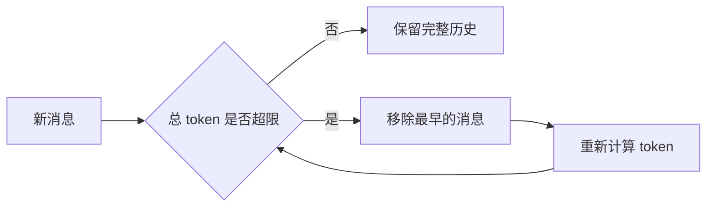
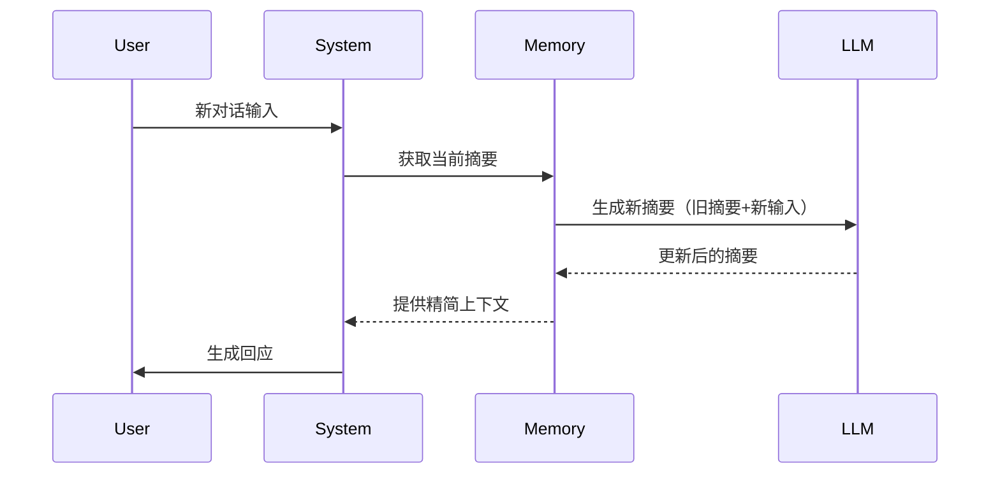
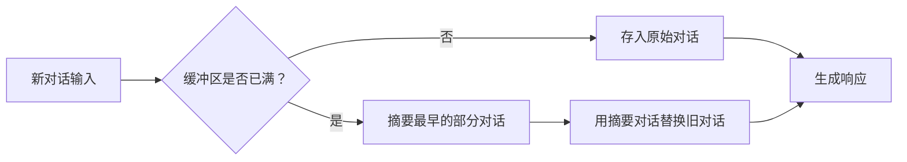
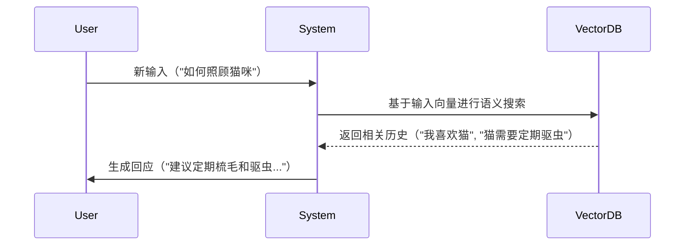

# `ConversationTokenBufferMemory`

基于 Token 数量控制的对话记忆机制。如果字符数量超出指定数目，它会切掉这个对话的早期部分，以保留与最近的交流相对应的字符数量

特点：

- Token 精准控制
- 原始对话保留

原理：



```python
from langchain.memory import ConversationTokenBufferMemory
from langchain_openai import ChatOpenAI

llm = ChatOpenAI(model="gpt-4o-mini")
memory = ConversationTokenBufferMemory(
	llm=llm,           # 需要传入 LLM，因为不同的 LLM 计算 token 的方式不同
	max_token_limit=10 # 设置 token 上限
)

memory.save_context({"input": "你好吗？"}, {"output": "我很好，谢谢！"})
memory.save_context({"input": "今天天气如何？"}, {"output": "晴天，25度"})

print(memory.load_memory_variables({}))
# {history: ''}
```

# `ConversationSummaryMemory`

是一种智能压缩对话历史的记忆机制，它通过大语言模型（LLM）自动生成对话内容的精简摘要，而不是存储原始对话文本

这种记忆方式特别适合长对话和需要保留核心信息的场景

特点：

- 摘要生成
- 动态更新
- 上下文优化

原理：



如果实例化 `ConversationSummaryMemory` 前，没有历史消息，可以使用构造方法实例化：

```python
from langchain.memory import ConversationSummaryMemory, ChatMessageHistory
from langchain_openai import ChatOpenAI

llm = ChatOpenAI(model="gpt-4o-mini")
memory = ConversationSummaryMemory(llm=llm)

memory.save_context({"input": "你好"}, {"output": "怎么了"})
memory.save_context({"input": "你是谁"}, {"output": "我是AI助手小智"})
memory.save_context({"input": "初次对话，你能介绍一下你自己吗？"}, {"output": "当然可以了。我是一个无所不能的小智。"})

# 读取消息（总结后的）
print(memory.load_memory_variables({}))
"""
{history: The human greets the AI in Chinese by saying hello, and the AI responds by asking, What's wrong? The human then asks, Who are you? and the AI replies, I am AI assistant Xiao Zhi. Additionally, the human asks for a self-introduction, and the AI describes itself as an all-capable assistant named Xiao Zhi.}
"""

# 原始对话
print(memory.chat_memory.messages)
"""
[HumanMessage(content=你好'), AIMessage(content=怎么了'), HumanMessage(content=你是谁'), AIMessage(content=我是AI助手小智'), HumanMessage(content=初次对话，你能介绍一下你自己吗？'), AIMessage(content=当然可以了。我是一个无所不能的小智。')]
"""
```

如果实例化 `ConversationSummaryMemory` 前，已经有历史消息，可以调用 `from_messages()` 实例化：

```python
from langchain.memory import ConversationSummaryMemory, ChatMessageHistory
from langchain_openai import ChatOpenAI

llm = ChatOpenAI(model="gpt-4o-mini")

# 原始消息
history = ChatMessageHistory()
history.add_user_message("你好，你是谁？")
history.add_ai_message("我是AI助手小智")

memory = ConversationSummaryMemory.from_messages(
	llm=llm,
	chat_memory=history,
)
# 继续添加新消息
memory.save_context(inputs={"human":"我的名字叫小明"},outputs={"AI":"很高兴认识你"})
```

# `ConversationSummaryBufferMemory`

是一种混合型记忆机制，它结合了 `ConversationBufferMemory`（完整对话记录）和 `ConversationSummaryMemory`（摘要记忆）的优点，在**保留最近对话原始记录**的同时，对较早的对话内容进行**智能摘要**

特点：

- 保留最近 N 条原始对话：确保最新交互的完整上下文
- 摘要较早历史：对超出缓冲区的旧对话进行压缩，避免信息过载
- 平衡细节与效率：既不会丢失关键细节，又能处理长对话

原理：



```python
# 场景：客服
from langchain.memory import ConversationSummaryBufferMemory
from langchain_openai import ChatOpenAI
from langchain_core.prompts import ChatPromptTemplate, MessagesPlaceholder
from langchain.chains.llm import LLMChain

llm = ChatOpenAI(
	model="gpt-4o-mini",
	temperature=0.5,
	max_tokens=500
)
prompt = ChatPromptTemplate.from_messages([
	("system", "你是电商客服助手，用中文友好回复用户问题。保持专业但亲切的语气。"),
	MessagesPlaceholder(variable_name="chat_history"),
	("human", "{input}")
])
memory = ConversationSummaryBufferMemory(
	llm=llm,
	max_token_limit=400,
	memory_key="chat_history",
	return_messages=True
)
chain = LLMChain(
	llm=llm,
	prompt=prompt,
	memory=memory,
)

# 模拟多轮对话
dialogue = [
	("你好，我想查询订单12345的状态", None),
	("这个订单是上周五下的", None),
	("我现在急着用，能加急处理吗", None),
	("等等，我可能记错订单号了，应该是12346", None),
	("对了，你们退货政策是怎样的", None)
]

# 执行对话
for user_input, _ in dialogue:
	response = chain.invoke({"input": user_input})
	print(f"用户: {user_input}")
	print(f"客服: {response['text']}\n")

# 查看当前记忆状态
print("\n=== 当前记忆内容 ===")
print(memory.load_memory_variables({}))
```

# `ConversationEntityMemory`（了解）

是一种基于实体的对话记忆机制，它能够智能地识别、存储和利用对话中出现的实体信息（如人名、地点、产品等）及其属性/关系，并结构化存储，使 AI 具备更强的上下文理解和记忆能力

好处：解决信息过载问题

- 长对话中大量冗余信息会干扰关键事实记忆
- 通过对实体摘要，可以压缩非重要细节（如删除寒暄等，保留价格/时间等硬性事实）

应用场景：在医疗等高风险领域，必须用实体记忆确保关键信息（如过敏史）被 100% 准确识别和拦
截

```txt
{"input": "我头痛，血压140/90，在吃阿司匹林。"},
{"output": "建议监测血压，阿司匹林可继续服用。"}
{"input": "我对青霉素过敏。"},
{"output": "已记录您的青霉素过敏史。"}
{"input": "阿司匹林吃了三天，头痛没缓解。"},
{"output": "建议停用阿司匹林，换布洛芬试试。"}
```

使用 `ConversationSummaryMemory`：

```txt
患者主诉头痛和⾼⾎压（140/90），正在服⽤阿司匹林。患者对⻘霉素过敏。三天后头痛未缓解，建议更换⽌痛药。
```

使用 `ConversationEntityMemory`：

```json
{
"症状": "头痛",
"⾎压": "140/90",
"当前⽤药": "阿司匹林（⽆效）",
"过敏药物": "⻘霉素"
}
```

|          | ConversationSummaryMemory                                | ConversationEntityMemory         |
| -------- | -------------------------------------------------------- | -------------------------------- |
| 输出       | 自然语言文本（一段话）                                              | 结构化字典（键值对）                       |
| 下游如何利用信息 | 需大模型“读懂”摘要文本，如果 AI 的注意力集中在“头痛”和“换药”上，可能会忽略过敏提示（尤其是摘要较长时） | 无需依赖模型的“阅读理解能力”，直接通过字段名（如过敏药物）查询 |
| 防错可靠性    | 低（依赖大模型的注意力）                                             | 高（通过代码强制检查）                      |
| 推荐处理     | 可以试试阿莫西林（一种青霉素类药）                                        | 完全避免推荐过敏药物                       |

```python
from langchain.chains.conversation.base import LLMChain
from langchain.memory import ConversationEntityMemory
from langchain.memory.prompt import ENTITY_MEMORY_CONVERSATION_TEMPLATE
from langchain_openai import ChatOpenAI

llm = ChatOpenAI(model_name='gpt-4o-mini', temperature=0)
# 使用 LangChain 为实体记忆设计的预定义模板
prompt = ENTITY_MEMORY_CONVERSATION_TEMPLATE
# 初始化实体记忆
memory = ConversationEntityMemory(llm=llm)
# 提供对话链
chain = LLMChain(
	llm=llm,
	prompt=prompt,
	memory=memory,
	# verbose=True
)

# 进行几轮对话，记忆组件会在后台自动提取和存储实体信息
chain.invoke(input="你好，我叫蜘蛛侠。我的好朋友包括钢铁侠、美国队长和绿巨人。")
chain.invoke(input="我住在纽约。")
chain.invoke(input="我使用的装备是由斯塔克工业提供的。")

# 查询记忆体中存储的实体信息
print(chain.memory.entity_store.store)
"""
{'蜘蛛侠': '蜘蛛侠是⼀个超级英雄，他的好朋友包括钢铁侠、美国队⻓和绿巨⼈。', '钢铁侠': '钢铁侠是蜘蛛侠的好朋友之⼀。', '美国队⻓': '美国队⻓是蜘蛛侠的好朋友之⼀。', '绿巨⼈': '绿巨⼈是蜘蛛侠的好朋友之⼀。', '纽约': '蜘蛛侠住在纽约。', '斯塔克⼯业': '斯塔克⼯业提供了蜘蛛侠使⽤的装备。'}
"""

# 基于记忆进行提问
answer = chain.invoke(input="你能告诉我蜘蛛侠住在哪里以及他的好朋友有哪些吗？")
```

# `ConversationKGMemory`（了解）

是一种基于知识图谱（Knowledge Graph）的对话记忆模块，它比 `ConversationEntityMemory` 更进一步，不仅能识别和存储实体，还能捕捉实体之间的复杂关系，形成**结构化的知识网络**

特点：

- 知识图谱结构将对话内容转化为（头实体、关系、尾实体）的三元组形式
- 动态关系推理

```shell
pip install networkx
```

```python
from langchain.memory import ConversationKGMemory
from langchain.chat_models import ChatOpenAI

llm = ChatOpenAI(model="gpt-4o-mini", temperature=0)
memory = ConversationKGMemory(llm=llm)

memory.save_context({"input": "向山姆问好"}, {"output": "山姆是谁"})
memory.save_context({"input": "山姆是我的朋友"}, {"output": "好的"})

# 查询会话
memory.load_memory_variables({"input": "山姆是谁"})
# {history: On ⼭姆: ⼭姆 是 我的朋友.'}

memory.get_knowledge_triplets("她最喜欢的颜色是红色")
"""
[KnowledgeTriple(subject='山姆', predicate='是', object_='我的朋友'), KnowledgeTriple(subject='山姆', predicate='最喜欢的颜色是', object_='红色')]
"""
```

# `VectorStoreRetrieverMemory`（了解）

是一种基于向量检索的先进记忆机制，它将对话历史存储在向量数据库中，通过**语义相似度检索**相关信息，而非传统的线性记忆方式。每次调用时，就会查找与该记忆关联最高的 k 个文档

适用场景：这种记忆特别适合需要长期记忆和语义理解的复杂对话系统

原理：



```python
import os
import dotenv
from langchain_openai import OpenAIEmbeddings
from langchain.memory import VectorStoreRetrieverMemory
from langchain_community.vectorstores import FAISS
from langchain.memory import ConversationBufferMemory

dotenv.load_dotenv()
os.environ['OPENAI_API_KEY'] = os.getenv("OPENAI_API_KEY1")
os.environ['OPENAI_BASE_URL'] = os.getenv("OPENAI_BASE_URL")

# ConversationBufferMemory
memory = ConversationBufferMemory()
memory.save_context({"input": "我最喜欢的食物是披萨"}, {"output": "很高兴知道"})
memory.save_context({"Human": "我喜欢的运动是跑步"}, {"AI": "好的,我知道了"})
memory.save_context({"Human": "我最喜欢的运动是足球"}, {"AI": "好的,我知道了"})
# 向量嵌入模型
embeddings_model = OpenAIEmbeddings(model="text-embedding-ada-002")
# 初始化向量数据库
vectorstore = FAISS.from_texts(memory.buffer.split("\n"), embeddings_model) # 空初始化
# 定义检索对象
retriever = vectorstore.as_retriever(search_kwargs=dict(k=1))
# 初始化 VectorStoreRetrieverMemory
memory = VectorStoreRetrieverMemory(retriever=retriever)

print(memory.load_memory_variables({"prompt": "我最喜欢的食物是"}))
# {history: Human: 我最喜欢的⻝物是披萨'}
```
