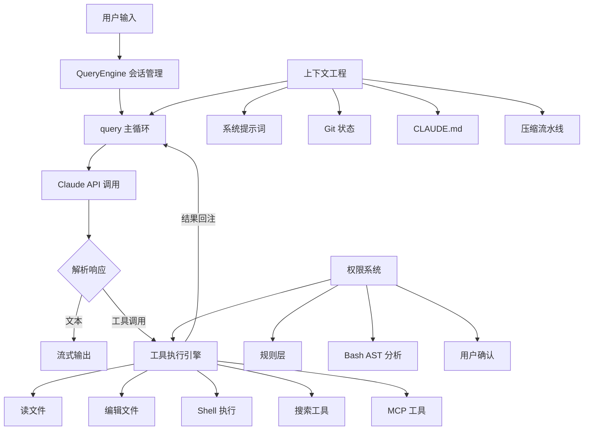

# 流程概览

# 从源码中发现的关键设计

> 以下内容均来自对源码的实际分析，不是猜测

## 为什么 Claude Code 用起来感觉那么快？

它其实做了三件聪明的事：

1. **全链路流式输出**：不是等模型全部想完再显示，而是每生成一个 token 就立刻展示。从 API 调用到终端渲染，整条链路都是流式的
2. **工具预执行**：模型说"我要读某个文件"的时候，这个文件其实已经在读了。系统在模型还在输出的同时就开始解析和执行工具调用，利用模型生成的 5-30 秒窗口，把约 1 秒的工具延迟藏起来了
3. **并行启动**：启动时把不相关的初始化任务并行执行，关键路径压到约 235 ms

## 出错了怎么办？—— 静默恢复

Claude Code 的策略是：**能恢复的错误，用户根本看不到**

比如：

- 对话太长超出了上下文窗口，它不会弹个错误框让你手动处理，而是悄悄压缩上下文、自动重试
- token 输出达到上限？自动从 4K 升级到 64 K 再重试

整个 Agent 循环有 7 种不同的"继续"策略，每种对应一种故障恢复路径

这就是为什么用 Claude Code 的时候很少遇到报错 —— 不是没有错误，而是大部分都被内部消化了

## 对话太长怎么办？—— 4 级渐进式压缩

当上下文快要超限时，不是一刀切地压缩，而是分 4 个级别逐步处理：

1. **裁剪**：先把历史消息中的大块内容（旧的工具输出）截断
2. **去重**：几乎零成本地去除重复内容
3. **折叠**：把不活跃的对话段落折叠起来，但不修改原始内容（可以展开恢复）
4. **摘要**：最后手段，启动一个子 Agent 对整个对话做摘要

每一级都可能释放足够的空间，让后面的级别不需要执行。而且压缩后系统会**自动恢复最近编辑的 5 个文件内容**，防止模型忘记刚刚在干什么

## 怎么防止 AI 执行危险操作？—— 5 层纵深防御

Claude Code 让 AI 直接在你电脑上跑命令，安全设计必须过硬。它不是靠一个"你确定吗？"对话框，而是搭建了 5 层防御体系：

1. **权限模式**：不同信任级别，限制可执行的操作范围
2. **规则匹配**：基于命令模式的白名单/黑名单
3. **Bash 命令深度分析**：用语法树分析（不是正则匹配）拆解 Shell 命令的真实意图，包含 23 项安全检查，覆盖命令注入、环境变量泄露、特殊字符攻击等
4. **用户确认**：危险操作弹出确认对话框，但有 200 ms 防抖保护，防止键盘连击导致误确认
5. **Hook 校验**：允许用户自定义安全规则，甚至可以动态修改工具的输入参数（比如自动给 `rm` 加上 `--dry-run`）

这五层任何一层拦住就不会执行，纵深防御

## 66 个工具如何协同工作？

所有工具 —— 读文件、写文件、跑命令、搜索、甚至第三方 MCP 工具 —— 都遵循**同一套接口规范**。这意味着：

- 第三方工具和内置工具走完全相同的执行流水线，享受同样的安全检查和权限控制
- 只读工具自动并行执行，写操作自动串行，不需要手动管理并发
- 工具输出超过 100K 字符时自动落盘，模型只拿到摘要和文件路径，需要时再读取全文

## 多个 Agent 如何协作？

Claude Code 支持三种多 Agent 模式：

- **子 Agent**：主 Agent 分派任务给子 Agent，等结果返回
- **协调器**：纯指挥官模式，协调器只能分配任务，**不能自己读文件、写代码**，强制分工
- **Swarm**：多个命名 Agent 之间点对点通信，各自独立工作

为了防止多个 Agent 同时改同一个文件产生冲突，系统用 Git Worktree 给每个 Agent 一份独立的代码副本
