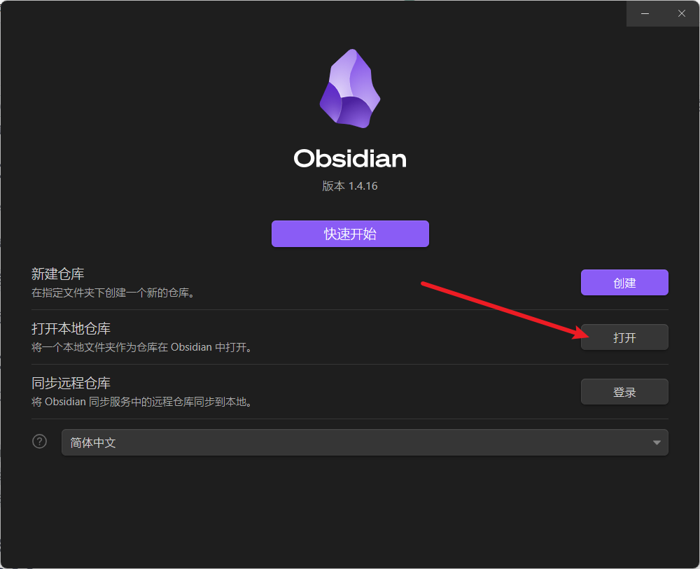
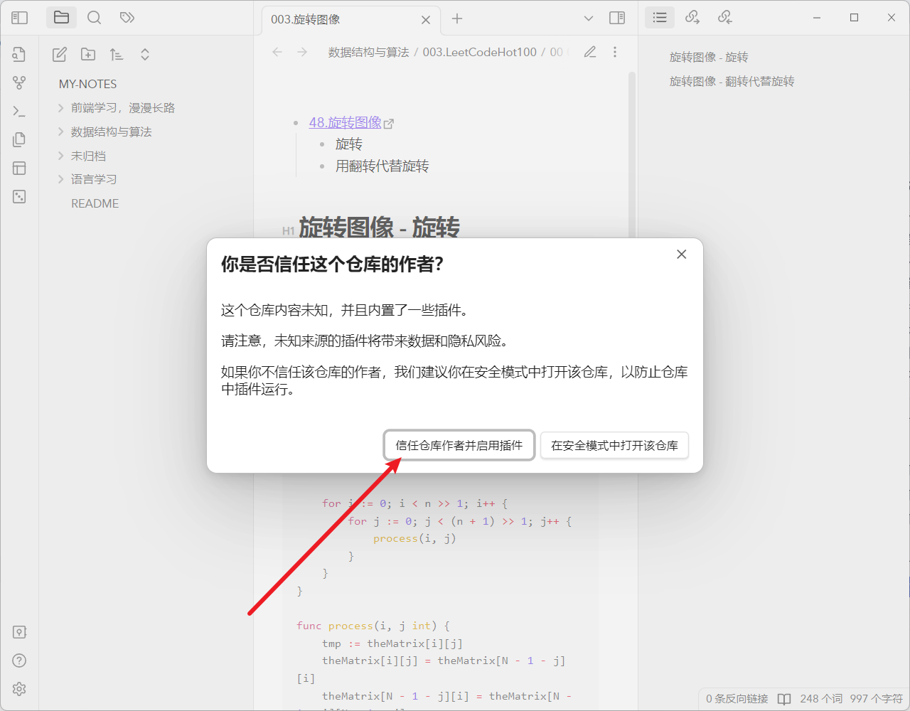

# my-notes
个人笔记，通过 Obsidian 管理

## 使用方式

1. clone 本仓库：`git clone https://github.com/xurenda/my-notes.git`
2. 下载 Obsidian：[https://obsidian.md/download](https://obsidian.md/download)
3. 使用 Obsidian 打开本仓库

4. 为了更好的体验，可以启用仓库内置的 Obsidian 插件（非必须）

