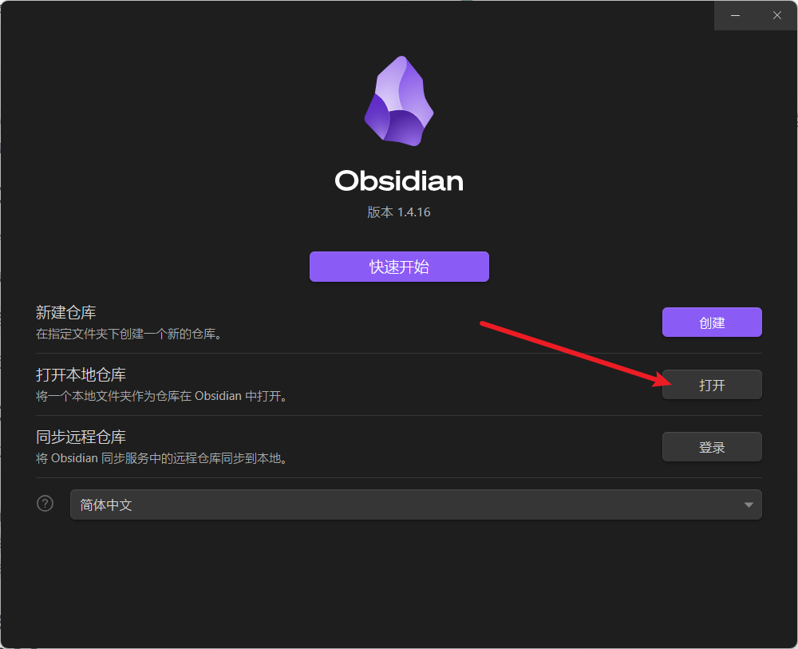
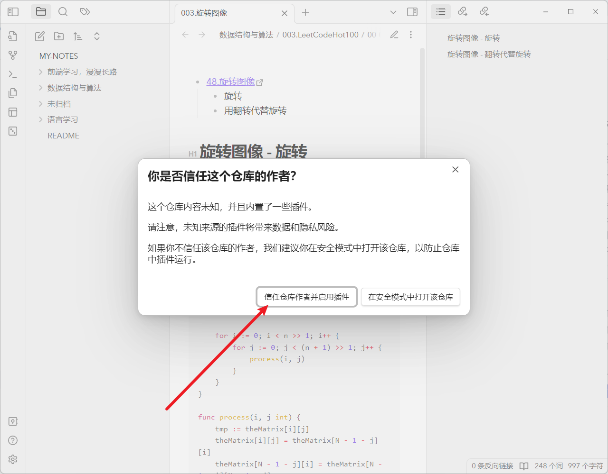

> [!warning] 注意
> 
> 在线网站不能保证 100% 还原 Obsidian 笔记内容，推荐使用本地方式浏览

个人笔记，通过 [Obsidian](https://obsidian.md/) 管理，在线网站由 [GitHub Pages](https://pages.github.com/) 和 [Quartz](https://github.com/jackyzha0/quartz) 提供支持。

GitHub 地址：[https://github.com/xurenda/my-notes](https://github.com/xurenda/my-notes)

# 使用方式

## 本地浏览

1. clone 本仓库到本地：`git clone https://github.com/xurenda/my-notes.git`
2. 下载 Obsidian：[https://obsidian.md/download](https://obsidian.md/download)
3. 使用 Obsidian 打开本仓库
      

4. 为了更好的体验，可以启用仓库内置的 Obsidian 插件（非必须）
      

## 在线网站

[xurenda.github.io](https://xurenda.github.io)

# TODO

## 从零实现 React18

- [[001.搭建项目架构|笔记]]
- [课程](https://appjiz2zqrn2142.xet-pc.citv.cn/p/t_pc/goods_pc_detail/goods_detail/p_638035c1e4b07b05581d25db?product_id=p_638035c1e4b07b05581d25db)
- 优先级：⭐️⭐️⭐️⭐️⭐️

## WebGL 编程指南

- [[001.WebGL 概述|笔记]]
- [[002.前端/011.高尖技术/001.webGL/001.WebGL 编程指南/000.图书信息|书籍]]
- 优先级：⭐️⭐️

## 左程云算法通关

- [[001.学习算法的语言问题以及如何开通gpt4|笔记]]
- [视频](https://space.bilibili.com/8888480)
- 优先级：⭐️⭐️⭐️⭐️

## LLM 系统学习

- [[001.大模型学习路线]]
- 优先级：⭐️⭐️⭐️⭐️⭐️

## 现代 JavaScript 教程

- [网址](https://zh.javascript.info/)
- 优先级：⭐️⭐️⭐️

## Node.js

- [[002.前端/003.JavaScript/003.运行时之 Node.js/001.介绍|笔记]]
- 优先级：⭐️⭐️

## Java 体系

- [[Java 路线]]
- 优先级：⭐️⭐️

Java SE 语言核心 -> Java Web -> JDBC -> SSM -> SpringBoot -> SpringCloud（AliBaba）

当前：笔记记到了 SSM

## 英语单词

- [[001.port|笔记]]
- [视频](https://www.bilibili.com/video/BV1aQ3EzSEgd/)
- 优先级：⭐️

英语单词进行中，下一步：语法、音标、...

## 高中数学

- [[学习规划|学习规划]]
- 优先级：⭐️

初中数学已完成，下一步：高中、大学（高数、线代）...
