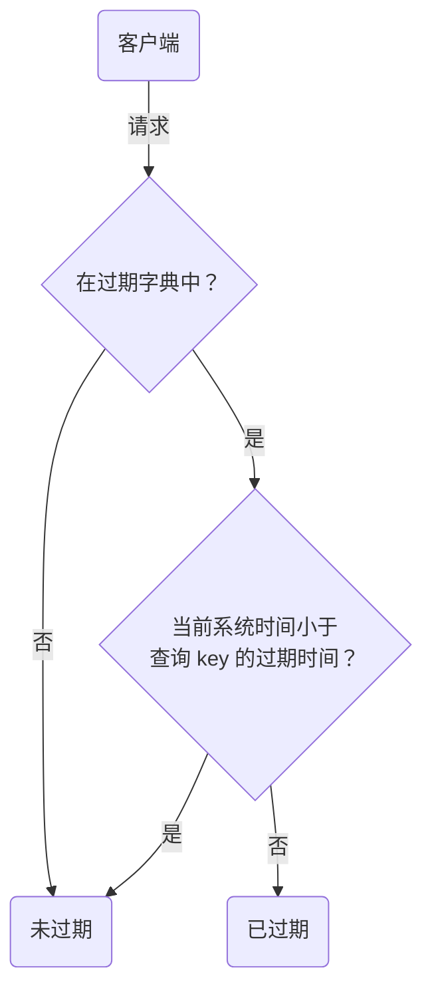

Redis 可以对 key 设置过期时间，过期删除策略：将已过期的键值对删除

# 设置过期

设置 key 过期时间的命令一共有 4 个：

- `expire <key> <n>`：key 在 n 秒后过期
- `pexpire <key> <n>`：key 在 n 毫秒后过期
- `expireat <key> <n>`：key 在指定时间戳后过期，精确到秒：10 位时间戳
- `pexpireat <key> <n>`：key 在指定时间戳后过期，精确到毫秒：13 位时间戳

设置字符串，同时对 key 设置过期时间，共有 3 种命令：

- `set <key> <value> ex <n>`：设置键值对，同时指定 n 秒后过期
- `set <key> <value> px <n>`：设置键值对，同时指定 n 毫秒后过期
- `setex <key> <n> <value>`：设置键值对，同时指定 n 秒后过期

其他：

- `TTL <key>`：查看某个 key 剩余存活时间（单位为秒，`-1` 表示永不过期）
- `PERSIST <key>`：取消 key 的过期时间，即：永不过期

# 如何判定 key 已过期了？

- Redis 使用一个[[016.哈希表|哈希表]]保存所有键值对数据
- 使用另一个名为==过期字典==（expires dict）的哈希表保存所有设置了过期时间的 key 和过期时间

```c
typedef struct redisDb {
    dict *dict;    // 键值对数据
    dict *expires; // 键的过期时间
    ...
} redisDb;
```

过期字典：

- `key` 是一个指针，指向某个键对象
- `value` 是一个 `long long` 类型的整数，表示 `key` 的过期时间（13 位的时间戳，精确到毫秒）

判定 key 是否过期的流程：



# 过期删除策略有哪些？

常见的三种过期删除策略：

- 定时删除
	- 在设置 key 的过期时间时，同时创建一个定时事件，当时间到达时，由事件处理器自动执行 key 的删除操作
	- 内存友好；CPU 不友好
- 惰性删除
	- 不主动删除过期键，每次访问 key 时，都检测 key 是否过期，如果过期则删除该 key
	- 内存不友好；CPU 友好
- 定期删除
	- 每隔一段时间「随机」取出一定数量的 key 进行检查，并删除其中的过期 key
	- 通过限制删除操作执行的时长和频率，权衡内存和 CPU 的资源占用
	- 问题是：难以很好地确定删除操作执行的时长和频率

==Redis 选择惰性删除 + 定期删除这两种策略配合使用==，以求在合理使用 CPU 时间和避免内存浪费之间取得平衡

## Redis 如何实现惰性删除？

在访问或者修改 key 之前，检查 key 是否过期：

- 如果过期，则删除该 key，可以异步删除也可以同步删除（根据 `lazyfree_lazy_expire` 参数配置决定），然后返回 `null`
- 如果没有过期，不做任何处理，返回正常的键值

## Redis 如何实现定期删除？

定期删除：每隔一段时间随机取出一定数量的 key 进行检查，并删除其中的过期 key

> 间隔检查的时间是多长？

Redis 默认每秒进行 10 次过期检查，可通过配置文件 `redis.conf` 进行配置：

```conf
// redis.conf
hz 10 // 默认每秒进行 10 次过期检查
```

> 随机抽查的数量是多少？

源码中，定期删除的实现在 `expire.c` 文件的 `activeExpireCycle` 函数中，其中随机抽查的数量由 `ACTIVE_EXPIRE_CYCLE_KEYS_PER_LOOP` 定义，它是写死在代码中的，数值是 20（[源代码](https://github.com/redis/redis/blob/unstable/src/expire.c#L92)）

定期删除的流程：

1. 从过期字典中随机抽取 20 个 key
2. 检查这 20 个 key 是否过期，并删除已过期的 key
3. 如果本轮检查的已过期 key 数量超过 5 个（占比大于 25%），则继续重复步骤 1，否则结束

可以看到，定期删除是一个循环的流程。为了保证不会出现循环过度，导致线程卡死现象，增加了定期删除循环流程的时间上限，默认不会超过 25ms

定期删除流程伪代码：

```c
do {
    expired = 0; // 已过期的数量
    num = 20; // 随机抽取的数量
    while (num--) {
        // 1. 从过期字典中随机抽取 1 个 key
        // 2. 判断该 key 是否过期，如果已过期则进行删除，同时 expired++
    }
    
    // 超过时间限制则退出
    if (timelimit_exit) return;

// 如果本轮检查的已过期 key 的数量，超过 25%，则继续随机抽查，否则退出本轮检查
} while (expired > 5);
```
