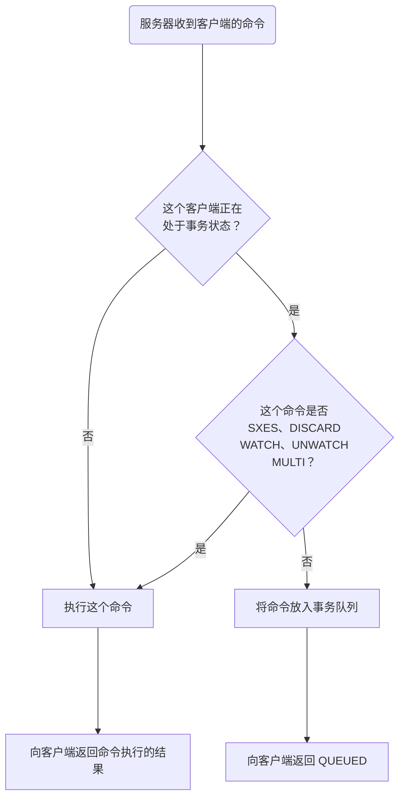

Redis 事务本质是一组命令的集合。事务支持==一次性==执行多个命令，一个事务中所有命令都会被序列化，==按照顺序串行化==执行队列中的命令，而==不会被其它命令插入==

总结说：Redis 事务就是一次性、顺序性、排他性的执行一个队列中的一系列命令

# 事务相关命令和使用

- `MULTI`：开启事务，Redis 会将后续的命令逐个放入队列中
- `EXEC`：执行事务中的所有操作命令
- `DISCARD`：取消事务，放弃执行事务块中的所有命令
- `WATCH`：监视一个或多个 key，如果事务在执行前，这个 key（或多个 key）被其他命令修改，则事务中断，不会执行事务中的任何命令
- `UNWATCH`：取消 `WATCH` 的监视

## 正常执行

```shell
# 开启事务
> MULTI
OK

# 将一系列命令逐个放入队列中
> set k1 11
QUEUED
> set k2 22
QUEUED

# 执行事务
> EXEC
1) OK
2) OK
```

## 取消事务

```shell
# 开启事务
> MULTI
OK

# 将一系列命令逐个放入队列中
> set k1 11
QUEUED
> set k2 22
QUEUED

# 取消事务
> DISCARD
OK
```

## 编译时错误

命令出现编译时错误，`exec` 直接返回错误，==所有命令都不执行==，事务提交失败

```shell
# 开启事务
> MULTI
OK

# 将一系列命令逐个放入队列中
> set k1 11
QUEUED
> sets k2 22
(error) ERR unknown command `sets`, with args beginning with: `k2`, `22`, 
# 语法错误，编译时报错

# 执行事务
> exec
(error) EXECABORT Transaction discarded because of previous errors.
```

## 运行时错误

命令出现运行时错误，`exec` 时会==跳过错误命令继续执行==，事务提交失败

- 注意是跳过，而不是中断，即：后续命令仍正常执行
- ==不提供事务回滚功能==，开发者必须在事务执行出错后，自行恢复数据库状态

```shell
# 开启事务
> MULTI
OK

# 将一系列命令逐个放入队列中
> set k1 11
QUEUED
> lpush k2 22
QUEUED
# 编译时无错，正常放入队列

# 执行事务
> exec
1) OK
2) (error) WRONGTYPE Operation against a key holding the wrong kind of value
# 类型错误，运行时报错
```

## watch 监视

假设需要原子性地为某个值进行增 1 操作，可以：

```shell
val = GET mykey
val = val + 1
SET mykey $val
```

这是三条命令，如果多个客户端同时访问同一个键，就会产生==竞争条件==。比如客户端 A 和 B 都读取了键原来的值（10），两个客户端都会将键的值设为 11 ，但正确的结果应该是 12 才对

`WATCH` 命令可以为 Redis 事务提供 check-and-set（CAS）行为：

```shell
WATCH mykey

val = GET mykey
val = val + 1
MULTI
SET mykey $val

EXEC
```

如果在 `WATCH` 和 `EXEC` 执行之间 `mykey` 的值发生变化，那么当前的事务就会失败。程序需要做的，就是不断重试这个操作，直到没有发生碰撞为止

这种形式的锁被称作乐观锁，它是一种非常强大的锁机制。因为大多数情况下，不同的客户端会访问不同的键，碰撞的情况一般都很少，所以通常并不需要进行重试

- 悲观锁（Pessimistic Lock）：每次拿数据时都认为别人会修改，所以每次在拿数据时==都会上锁==，防止别人修改
- 乐观锁（Optimistic Lock）：每次拿数据时都认为别人不会修改，所以不会上锁，但在更新的时候会判断一下在此期间别人有没有去更新这个数据
	- 传统乐观锁：
		- 每个数据有一个版本号，写操作需要将版本号加一
		- 拿数据时记录版本号，提交时判断版本号是否增加
		- 不增加：表示在此期间数据没有被修改，执行更新
		- 增加：表示在此期间数据被修改，不执行更新
	- Redis 事务提供 CAS 行为：
		- 数据不需要版本号，而是通过 `WATCH` 命令对数据监控
		- 如果在 `EXEC` 命令之前至少修改了一个被监视的键
		- 则整个事务将中止，返回 `nil` 通知事务失败

取消监听：

- 一旦执行了 `EXEC`，之前加的监控锁都会被取消掉
- 当客户端连接丢失，所有东西都会被取消监视
- 手动调用 `UNWATCH`

# 事务执行步骤

1. 开启：以 `MULTI` 开始一个事务
2. 入队：将多个命令入队到事务中，接到这些命令并不会立即执行，而是放到等待执行的事务队列中
3. 执行：由 `EXEC` 命令触发事务执行

当一个客户端切换到事务状态后，服务器会根据这个客户端发来的不同命令执行不同的操作：



# 与传统数据库事务的比较

Redis 的事务与传统数据库的事务概念相差很大，可以理解为仅仅是叫同一个名字而已

- 不支持事务回滚，无法保证同时成功或同时失败
- 原子性（atomicity）：原子性有多种理解（一般理解为第一种）
	- 所有的命令依次执行，期间不会插入其他命令：Redis 事务可以保证
	- 所有的命令，要么全部执行，要么全部不执行：Redis 事务可以保证
	- 所有的命令，要么全部成功，要么全部失败：Redis 事务无法保证
- 一致性（consistency）：Redis 事务可以保证命令失败的情况下得以回滚，数据能恢复到没有执行之前的样子，是保证一致性的，除非 Redis 进程意外终结
- 隔离性（Isolation）：
	- Redis 事务是严格遵守隔离性的，因为 Redis 命令是单进程模式，可以保证命令执行过程中不会被其他客户端命令打断
	- 但是，Redis 不像其它结构化数据库有隔离级别这种设计
- 持久性（Durability）：==Redis 事务是不保证持久性的==，因为 Redis 持久化策略中不管是 RDB 还是 AOF 都是异步执行的，不保证持久性是出于对性能的考虑

# Lua 脚本

Lua 脚本也可以实现事务，Redis 可以==保证脚本内的命令一次性、按顺序地执行==。同样也不提供事务回滚，执行过程中部分命令运行错误，不影响其他命令的执行
